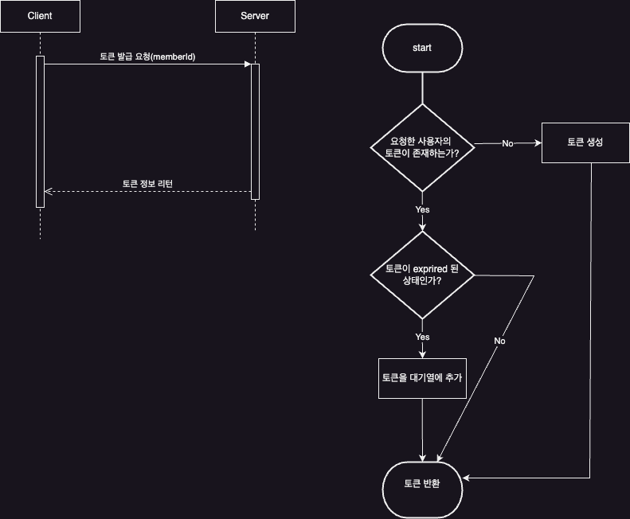
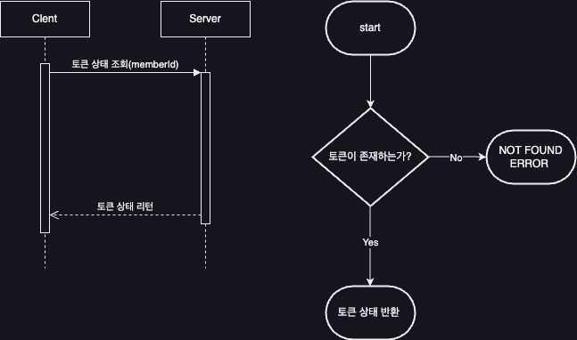
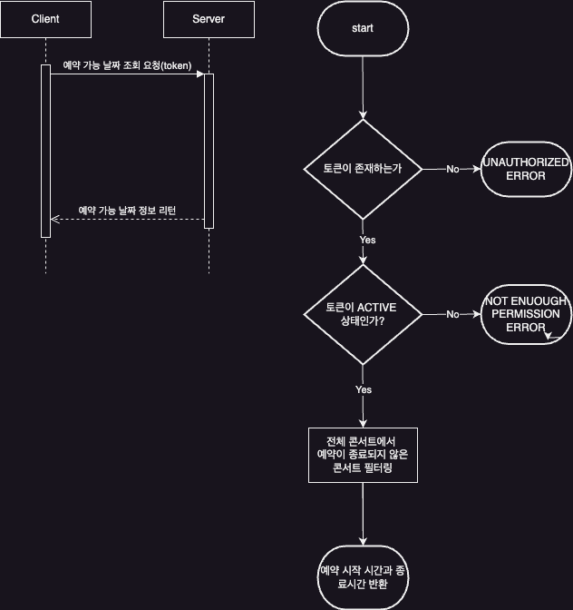
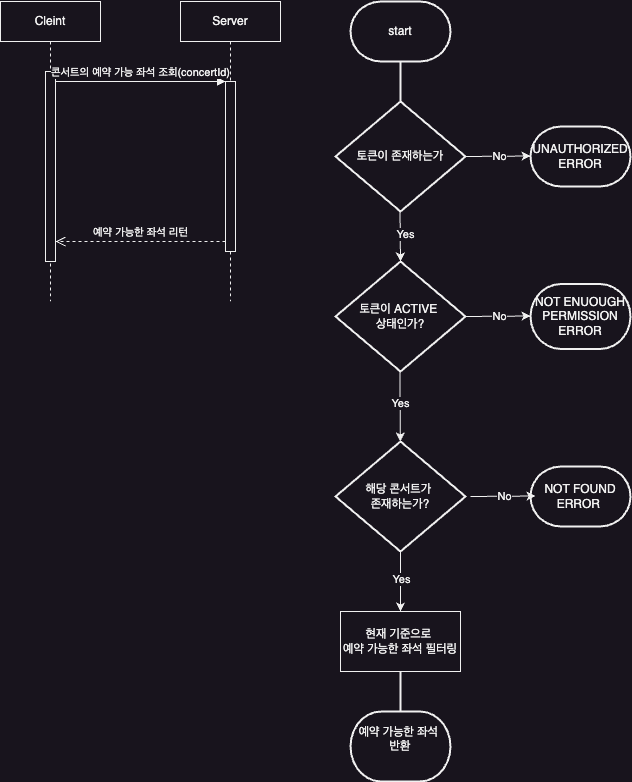
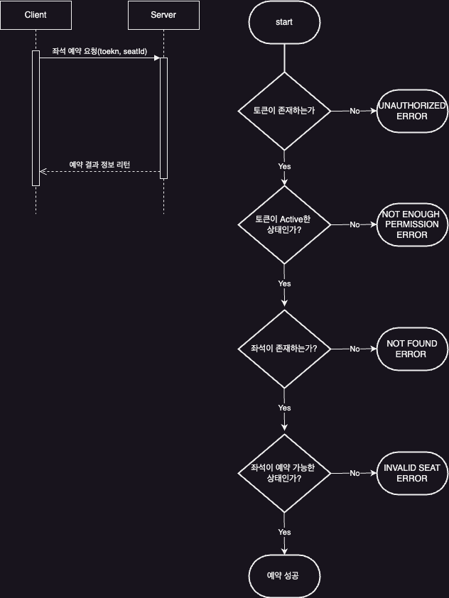
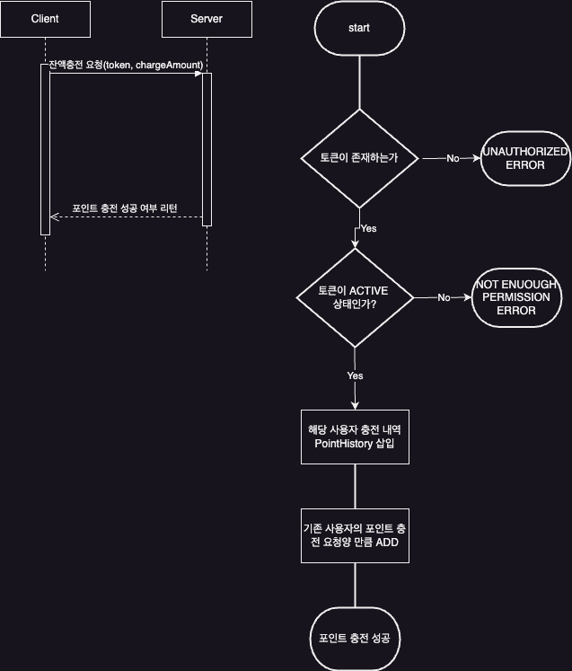
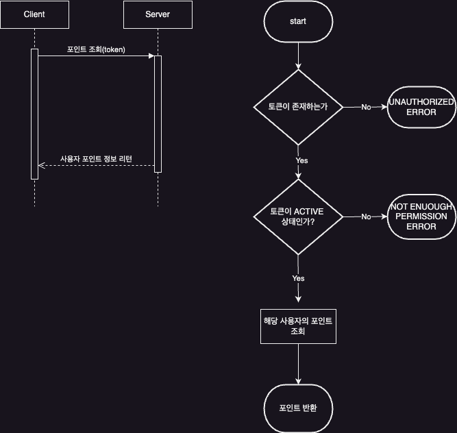
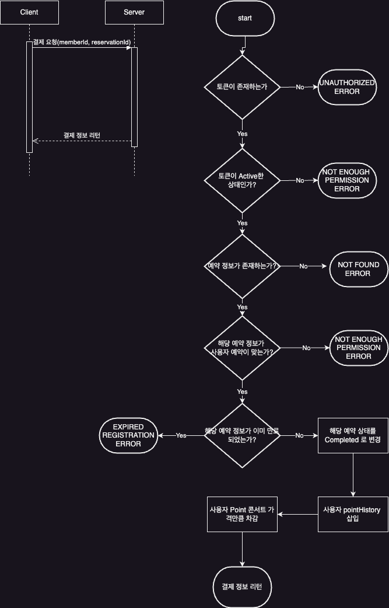
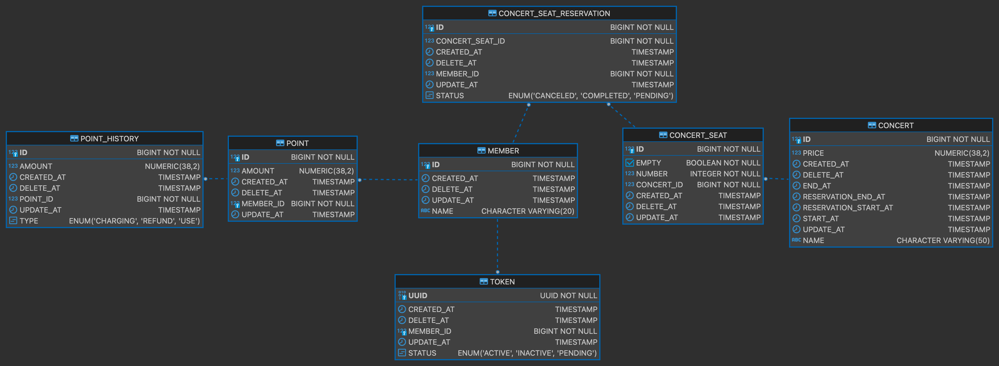
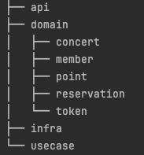

# 콘서트 예약 시스템

---

## Description

1. 콘서트 예약 서비스를 구현한다.
2. 대기열 시스템을 구축하고, 예약 서비스는 작업 가능한 유저만 수행할 수 있도록 한다.
3. 사용자는 좌석 예약 전에 미리 충전한 잔액을 이용한다.
4. 좌석 예약 요청 시에, 결제가 이루어지지 않더라도 일정 시간동안 다른 유저가 해당 좌석에 접근할 수 없도록 한다.

---

## Requirements

1. 아래 5가지 API를 구현한다.
    - 유저 토큰 발급 API
    - 예약 가능 날짜 / 좌석 API
    - 좌석 예약 요청 API
    - 잔액 충전 / 조회 API
    - 결제 API
2. 각 기능 및 제약사항에 대해 단위 테스트를 반드시 하나 이상 작성한다.
3. 다수의 인스턴스로 어플리케이션이 동작하더라도 기능에 문제가 없도록 작성한다.
4. 동시성 이슈를 고려한다.
5. 대기열 개념을 고려한다.

---

## 시퀀스 다이어그램

### 토큰 발급 API

### 토큰 상태 조회 API

### 콘서트 예약 가능한 날짜 조회 API

### 콘서트의 예약 가능한 좌석 조회 API

### 콘서트 좌석 예약 API

### 포인트 충전 API

### 포인트 조회 API

### 결제 API

---

## 마일스톤

총 3주 10.5MD 부여(3.5MD/week)

### 3주차

**프로젝트 DB 및 패키지 설계** -> 1.5MD

**ER 다이어그램 문서 작업** -> 0.5MD

**시퀀스 다이어그램 및 플로우 차트** -> 1.0MD

**MOCK API 구현** ->  0.5MD

### 4주차

**토큰 발급 및 상태 조회 API 구현** -> 0.75MD

**콘서트 예약 가능한 날짜 조회 및 좌석 조회 API 구현** -> 0.75MD

**좌석 예약 API 구현** -> 1MD

**포인트 충전, 조회, 결제 API 구현** -> 1MD

### 5주차

**스케줄러와 DB 테이블을 이용한 토큰 대기열 구현** -> 1MD

**성능 최적화(DB 인덱스 및 소스)** -> 1MD

**Redis 및 다른 기술 스택 적합성 검사 및 적용** -> 1.5MD

---

## ER 다이어그램

---

## 패키지 구조

1. api : controller 들을 담을 패키지 입니다.
2. domain : 도메인 레이어 객체들(서비스, JPA entity(=도메인 모델), 도메인 밸류 객체) 을 담을 패키지 입니다. -> 현재 설계 상으로 총 5개의 도메인
   concert, member, point, reservation, token 이 있습니다.
3. infra : infrastructure-persistence Layer(repository) 의 클래스들을 담을 패키지 입니다.
4. usecase : service 간의 의존성이 생길 경우, 순환참조가 발생할 수 있으므로, 서비스들의 퍼사드 클래스들을 담을 패키지 입니다.

--- 
기술 스택

1. **DBMS** : H2
2. **development** : springboot, jpa, spring-scheduler
3. **test** : junit5
4. **in-memory** : Redis

현재 **scheduler** 을 통해 **대기열에 있는 토큰을 일정 수량만큼 active로 바꾼다**거나 예약된 좌석의 경우 5분 동안 결제가 안되면 점유상태를 뺏기게 되는
정책을
적용할 예정입니다. 추후 성능상 이슈가 발생할 경우, Redis를 도입할 예정입니다. 

